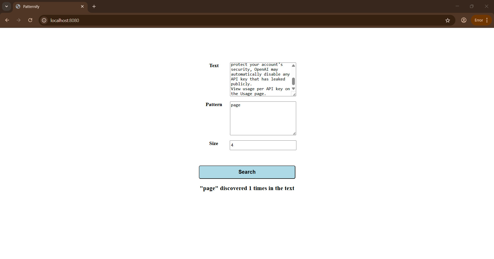

# Dockerizing a Node.js web app
#### Build the app’s container image
Take a look at Dockerfile:
```bash
services:
  app:
    build: .
#    image: rfinland/node-web-app:latest
    container_name: nodejs_app
    ports:
      - "8080:8080"
    volumes:
      - .:/app
    environment:
      - NODE_ENV=development
      - Maintainer=rfatolahzade
    networks:
      - nodejs_network
    restart: always

networks:
  nodejs_network:
    driver: bridge
```
# Image
Now build the container image using the docker build command:
```bash
docker build . -t node-web-app

```
This command used the Dockerfile to build a new container image. You might have noticed that a lot of “layers” were downloaded.
This is because we instructed the builder that we wanted to start from the node:16 image.
But, since we didn’t have that on our machine, that image needed to be downloaded.
List of your images:
```bash
docker images
```
# Container
Now that we have an image, let’s run the application. To do so, we will use the docker run command.
Start your container using the docker run command and specify the name of the image we just created:
```bash
docker run --name=mycontainer -p 8080:8080 -d node-web-app 
```
Inside the container you can see the content of the script folder as well.
List of your containers:
```bash
docker ps -a
```
Here you go, a container named "mycontainer", exposed port "8080:8080" is there.
If you take a look inside your container you can see your script directory as well:

```bash
docker exec -it mycontainer /bin/sh
```

After that run exit to exit from container.

# Test the app
Via terminal:
```bash
curl -i localhost:8080
```
Via browser:

Open your web browser to http://localhost:8080. You should see your app.
Depends on your machine (VirtualMachine) maybe you have to set port forwarding (port:8080)
and then visit: http://localhost:8080/



# MultiStage Dockerfile
```bash
#####Build stage
FROM node:24.1.0-alpine3.21 AS build
LABEL maintainer="rfatolahzade <https://github.com/rfatolahzade>" \
      contributor="MJ <https://github.com/dashtaki>" \
      repository="https://github.com/rfatolahzade/Dockerizing-a-NodeJS-web-app"

WORKDIR /usr/src/app
COPY script/package*.json ./

RUN npm ci && npm cache clean --force

COPY script/ .
COPY test/ .
RUN npm test
#####Final stage
FROM node:24.1.0-alpine3.21
WORKDIR /usr/src/app

COPY --from=build /usr/src/app/package*.json ./

RUN npm ci --omit=dev && npm cache clean --force && rm package-lock.json

COPY --from=build /usr/src/app ./

EXPOSE 8080

RUN chown -R node:node /usr/src/app
USER node

CMD [ "node", "app.js" ]

```

## Docker Images

### 📦 Pull from Docker Hub
```bash
docker pull rfinland/node-web-app:latest
````

### 📦 Pull from GitLab Container Registry

```bash
docker pull registry.gitlab.com/rfatolahzade/dockerizing-a-nodejs-web-app/node-web-app:latest
```

### 📦 Pull from Github Container Registry

```bash
docker pull ghcr.io/rfatolahzade/dockerizing-a-nodejs-web-app:main
```


